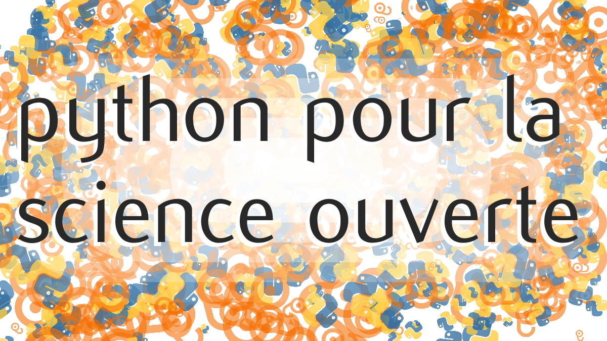

* twitter : [#py_so](https://twitter.com/hashtag/py_so?src=hashtag_click)

 
 

[Applications](#applications) | [Techniques](#techniques-à-maîtriser) | [Contexte](#contexte)
 
## Applications

### Identifier les publications HAL de son établissement issues des projets ANR qui ne sont pas en accès ouvert

| <!-- -->| <!-- -->|
| ------ | ----------- |
|Difficulté| faible   |
|Exercice | [pub_projet_research_hal_no_oa.ipynb](exo/pub_projet_research_hal_no_oa.ipynb) |
|Compétences| requêtes API HAL, json vers dataframe|
|Objectif | faire respecter l'obligation d'accès ouvert|
<!-- |Démo | [pub_projet_research_hal_no_oa.ipynb](demo/pub_projet_research_hal_no_oa.ipynb)|
-->
 

### Représenter l'évolution et les types de dépôts dans HAL d'une structure ou institution

| | |
| -------- |--------|
|Difficulté| faible |
|Exercice | [hal_evol_depots.ipynb](exo/hal_evol_depots.ipynb) |
|Compétences| requêtes API de HAL en série, json vers dataframe, plot histogramme|
|Objectif | Automatiser la production de statistiques pour les unités de recherche|
<!--|Démo | [hal_evol_depots.ipynb](demo/hal_evol_depots.ipynb)|
--> 
 

### Récupérer les identifiants des projets de recherche ANR portés par son établissemement

| | |
| -------- |--------|
|Difficulté| moyen |
|Exercice | [get_anr_research_project.ipynb](exo/get_anr_research_project.ipynb) |
|Compétences| requêtes aurehal structure, données API, read_csv, filtre|
|Objectif | initier une politique de suivi des publications des projets de recherche ANR|
|Démo | [get_anr_research_project.ipynb](demo/get_anr_research_project.ipynb) |

 

### Niveau de bruit de son établissement dans le référentiel structure de HAL

| | |
| -------- |--------|
|Difficulté| faible |
|Exercice | [aurehal_struct_noise.ipynb](exo/aurehal_struct_noise.ipynb) |
|Compétences| requêtes aurehal structure, données API, fonction|
|Objectif | Mesurer le niveau de bruit de son établissement dans le référentiel HAL structure|
|Démo | [aurehal_struct_noise.ipynb](demo/aurehal_struct_noise.ipynb) |

 

### Extraire un tableau des structures non valides de son étab. avec le nombre de documents associés

| | |
| -------- |--------|
|Difficulté| moyen |
|Exercice | [aurehal_struct_incoming_list.ipynb](exo/aurehal_struct_incoming_list.ipynb) |
|Compétences| requêtes aurehal struct, données API, fonction apply|
|Objectif | Nettoyer les structures de son établissement dans le référentiel AureHAL|
|Démo | [aurehal_struct_incoming_list.ipynb](demo/aurehal_struct_incoming_list.ipynb)|

 

### Calculer le niveau de bruit dans le référentiel structures des établissements ayants un portail HAL

| | |
| -------- |--------|
|Difficulté| moyen  |
|Compétences| requêtes aurehal struct, données API, fonction|
|Objectif | Sensibiliser les adminsitrateurs HAL à la propreté du référentiel structure|
|Démo | [aurehal_struct_noise_per_institution.ipynb](demo/aurehal_struct_noise_per_institution.ipynb) |

 

### Représenter le niveau de bruit des établissements dans le référentiel structure

| | |
| -------- |--------|
|Difficulté| moyen  |
|Compétences| wordcloud, pandas, matplotlib|
|Objectif | Rendre comte du niveau de bruit des étab. dans le ref. structure|
|Démo | [aurehal_struct_noise_per_institution_graph.ipynb](demo/aurehal_struct_noise_per_institution_graph.ipynb) |

cf. résultats [nuage de mots-clés](https://raw.githubusercontent.com/ml4rrieu/py_so/main/img/aurehal-struct-cleaniest-institutions.png)

 

### Vérifier à partir d'une source externe la présence en accès ouvert dans HAL des publications de son établissement

| | |
| -------- |--------|
|Difficulté| fort  |
|Compétences| API ScanR, Permissions, Module python|
|Objectif | Identifier les publications de son établissement pouvant être déposées en accès ouvert #HALathon|
|Démo | [github.com/ml4rrieu/halathon](https://github.com/ml4rrieu/halathon)|

Notebook réalisé dans le cadre du [CasuHalathon 2021](https://casuhal2021.sciencesconf.org/resource/page/id/8) 

 

### Retrouver dans Zenodo les jeux de données de son établissement 

| | |
| -------- |--------|
|Difficulté| moyenne  |
|Compétences| API Zenodo, JSON, iterations |
|Objectif | Retrouver les jeux de données déposés dans Zenodo relevant de son établissement|
|Démo | [get_dataset_from_zenodo.ipynb](demo/get_dataset_from_zenodo.ipynb)|

<!--

_a_faire_

* Représenter ce que le WOS ne référence pas

Récupérer les données du BSO [Univ. Paris](https://github.com/ml4rrieu/bso_univ_paris). Identifier ce qui n'est pas dans le WOS. 

Identifier dans les chapitres d'ouvrage qui peuvent être déposés en Accès ouvert. pour Springer voir
https://oaamu.hypotheses.org/2197
-->

 
 

## Pré-requis

- Avoir les compétences décrites jusqu'au chapitre 4 du manuel _Python pour les SHS_ 
- Maîtriser les APIs de HAL (l'API générale "search" et celle du référentiel structures de Aurehal)
- Bonne connaissance du paysage de l'Enseignement Supérieur et de la Recherche et des enjeux de la science ouverte

 
 

## Techniques à maîtriser

* différentes syntaxes pour imprimer : `print("ici", "là"), print(f"{ma_variable} encore") , print("{} dernière".format("une"))`
* Request, pandas
* passer des données en JSON en dataframe (Pandas)
* fonction avec argument 
* sortir un résultat structuré
* filtrer une dataframe, extraire une liste, ajouter colonne 

 
 

## Contexte

* 2022-10, URFIST Occitanie
* 2021-11, URFIST Occitanie

Formation initiée en 2021 avec Emilien Shultz, à la suite de l'excellent ouvrage _Python pour les SHS_ ([pyshs.fr](http://pyshs.fr/)). Formation en deux volets (2* 1.5 jours) : _Python les fondamentaux_ et _Python pour la science ouverte_.

> Un langage de programmation ne s'apprend pas en trois jours.

La formation ne vous permettra pas de programmer en python. Par contre la réalisation des exercices, le livre _Python pour les SHS_, des MOOCs, votre perséverance et curiosité vous permettront de comprendre et écrire du python.

 
 

## Outils

* JSON Viewer https://jsoncrack.com/editor

* Excellent cours sur python https://melaniewalsh.github.io/Intro-Cultural-Analytics/welcome.html

* Ressource phySHS https://github.com/pyshs/ressources-pyshs

* matplotlib Cheatsheets https://github.com/matplotlib/cheatsheets
